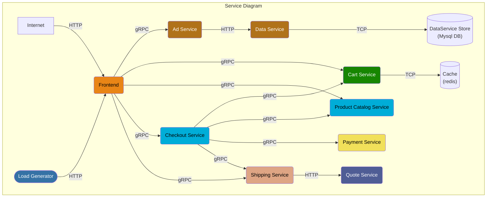
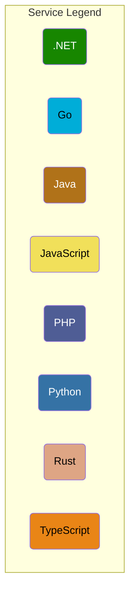

# OpenTelemetry Demo Lite Helm Chart

This chart is an extension of [OpenTelemetry Demo](https://github.com/open-telemetry/opentelemetry-demo) and
[OpenTelemetry Demo Chart](https://github.com/open-telemetry/opentelemetry-helm-charts/tree/main/charts/opentelemetry-demo).

## Architecture

This chart only retains those core services to ensure the shopping flow. Below is the current service diagram:





## Changelog

We have made certain modifications to the official demo, and the following are the specific details of the modifications.

### Re-implement components

#### [Adservice](https://github.com/openinsight-proj/opentelemetry-demo/tree/daocloud/src/adservice-v2#note-the-overall-helm-chart)

- integrate nacos
- integrate sentinel
- support grpcurl
- [expose Prometheus metrics](https://github.com/openinsight-proj/adservice#metrics)
- [mock latency](https://github.com/openinsight-proj/adservice#mock-latency)
- [50% error rate](https://github.com/openinsight-proj/adservice#mock-error)
- call Dataservice to get Ad data

#### [Checkoutservice](https://github.com/openinsight-proj/opentelemetry-demo/tree/daocloud/src/checkoutservice-v2#checkout-service)

- doesn't depend Emailservice
- doesn't depend Currencyservice
- doesn't depend Kafka

### Added components

#### [Dataservice](https://github.com/openinsight-proj/opentelemetry-demo/tree/daocloud/src/dataservice)

This service only used by Adservice. It will accept Adservice's http request then response Ad data from mysql.

### Official chart re-configuration

1. Close all none business services, such as Opentelemetry collector, Prometheus, Jaeger, Grafana,
   all service's telemetry data will fellow this data flow: `Components --> Insight-agent OTel collector`。

2. Support deploying Redis instance from a  Redis operator(Make sure Redis operator already works).

## Install

_Note：make sure Insight agent already works(If`--set .global.middleware.redis.deployBy=redisCR`, make sure Redis 
operator already works)_

```shell
helm repo add open-insight https://openinsight-proj.github.io/openinsight-helm-charts

helm install webstore-demo open-insight/opentelemetry-demo-lite -n webstore-demo --create-namespace
```

## Common chart param

Please use `values.schema.json` to get to know how to control the deployment behavior of this chart(use 
[json schema editor](https://form.lljj.me/#/demo?ui=VueElementForm&type=Test) to parse the schema and use 
[json-to-yaml](https://codebeautify.org/json-to-yaml) to generate values.yaml).


