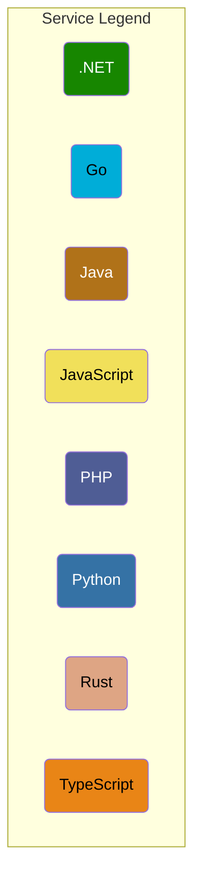

# OpenTelemetry Demo Lite Helm Chart

这个 Chart 是官方 [OpenTelemetry Demo](https://github.com/open-telemetry/opentelemetry-demo) 和
[OpenTelemetry Demo Chart](https://github.com/open-telemetry/opentelemetry-helm-charts/tree/main/charts/opentelemetry-demo)
的扩展。

## 架构

这个 Chart 在保证购物主流程正常的情况下缩减了其他服务。以下是 OpenTelemetry Demo Lite 的架构图:




## 涉及的改动

我们对官方的 Demo 做了一定的改造，以下是具体的改造细节。

### 重写的组件

#### [Adservice](https://github.com/openinsight-proj/opentelemetry-demo/tree/daocloud/src/adservice-v2#note-the-overall-helm-chart)

这个组件在重写后增加了以下功能：
- 服务接入 nacos
- 服务接入 sentinel
- 支持 grpcurl 请求
- [暴露 Prometheus 指标](https://github.com/openinsight-proj/adservice#metrics)
- [延时模拟](https://github.com/openinsight-proj/adservice#mock-latency)
- [50% 的请求错误率](https://github.com/openinsight-proj/adservice#mock-error)
- 从 Dataservice 获取 Ad 数据

#### [checkoutservice](https://github.com/openinsight-proj/opentelemetry-demo/tree/daocloud/src/checkoutservice-v2#checkout-service)

具体的改动：

- 不再调用 Emailservice
- 不再调用 Currencyservice
- 不再依赖 Kafka

### 增加的组件

#### [Dataservice](https://github.com/openinsight-proj/opentelemetry-demo/tree/daocloud/src/dataservice)

这个组件只被 Adservice 调用，在收到请求后，它会去 Mysql 中获取相关的数据并返回给 Adservice。

### 官方 chart 参数改造

1. 我们关闭了所有非业务组件，比如： Opentelemetry collector, Prometheus, Jaeger, Grafana等，在我们的版本中不需要用它们展示数据。
   业务的观测性数据传输路径变成了：`Components --> Insight-agent OTel collector`。

2. 支持通过 Redis operator 拉起 Redis 实例（保证 Redis operator 已经安装并正常工作）。
   默认情况下使用官方的方式创建 Redis（`--set .global.middleware.redis.deployBy=builtin`）,
   你可以通过 `--set .global.middleware.redis.deployBy=redisCR` 下发 Redis CR, 最后由 Redis operator 拉起 Redis 实例。

## 安装

_前提条件：请保证 Insight agent 已经安装并就绪(在 `--set .global.middleware.redis.deployBy=redisCR` 时请求保证 Redis operator
已经安装并正常工作)_

```shell
helm repo add open-insight https://openinsight-proj.github.io/openinsight-helm-charts

helm install webstore-demo open-insight/opentelemetry-demo-lite -n webstore-demo --create-namespace
```

## 常见参数

| 参数位置 | 参数说明                                                                                                                                            |
| -------- |-------------------------------------------------------------------------------------------------------------------------------------------------|
|adservice.enabled| 为 true 时部署adservice                                                                                                                             |
|microservices.nacos.enabled| 改为 true，将会额外部署两个服务：dataservice, mysql, dataservice 会从 mysql 中获取广告数据，adservice 会向 dataservice 请求广告数据。此外，adservice, dataservice两个服务会被注册到nacos注册中心 |
|microservices.nacos.registryAddr| 请修改为集群内nacos的可解析的域名，注意要带namespace                                                                                                               |

更多的参数配置可以将 `values.schema.json` 文件中的内容复制到[ json schema editor ](https://form.lljj.me/#/demo?ui=VueElementForm&type=Test)
进行实时配置编辑，用[ json-to-yaml ](https://codebeautify.org/json-to-yaml)将编辑的j结果转成 yaml。


